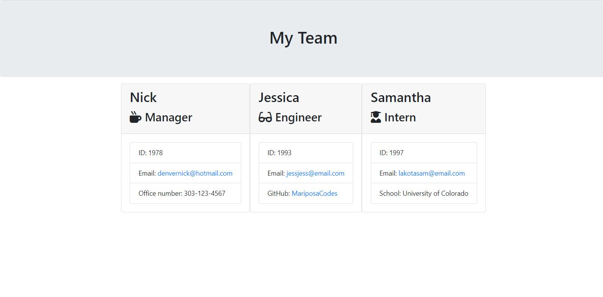

# Title: Team Profile Generator

### URL: https://drive.google.com/file/d/1so5yskli4EY3dHFrP0g877eq1efzan0s/view

## Description

Allows you to generate team profile cards for your project, each one specific to role"

## Table of Contents

- [Installation](#installation)
- [Usage](#usage)
- [Future Developments](#futureDevelopments)
- [Credits](#credits)
- [Questions](#questions)

## Installation

`clone repo, npm i, node app.js, go to browser and view team.html`

## Usage

Creates role specific cards for teammates, using the npm inquirer package

## Future Developments

Add different roles

## Credits

- [Inquirer](https://www.npmjs.com/package/inquirer)

- [Bootstrap](https://getbootstrap.com/)

- [Font Awesome](https://fontawesome.com/)

  ## Contributors:

  Nicholas C. Maas

  ## Questions?

  Contact me at [denvernick@hotmail.com]

  or[![Follow on Github] (https://img.shields.io/github/followers/NekoCarreraDesigns?label=Follow&style=social)](http://www.github.com/NekoCarreraDesigns)

  Copyright © 2020 Nicholas C. Maas (http://www.github.com/NekoCarreraDesigns)

  ***

  ##### \_Created with [NekoCarreraDesigns readme generator] (https://github.com/NekoCarreraDesigns/readme-generator)
